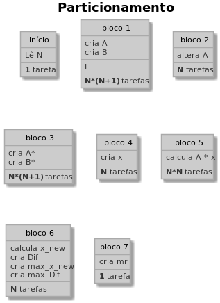

# Jacobi-Richardson PCAM

O problema resume-se em:
 - Criar a matriz A que garanta convergência e criar o vetor coluna B
 - Calcular a matriz A* e B* (a partir de A e B)
 - Calcular o vetor coluna x a cada iteração (a partir de A* e B*)
 - Calcular o vetor Dif a cada iteração (a partir de x)
 - Calcular Mr a cada iteração (a partir de Diff)
 
##### Variáveis principais do problema

|Variável  |Escalar|Linhas|Colunas|Comentário                           |
|----      |----   |----  |----   |---                                  |
|N         |Sim    |-     |-      |ordem do problema                    |
|A         |Não    |N     |N      |matriz do problema                   |
|A*        |Não    |N     |N      |matriz A alterada                    |
|B         |Não    |N     |1      |vetor coluna independente            |
|B*        |Não    |N     |1      |vetor coluna B alterado              |
|x         |Não    |N     |1      |vetor solução atual                  |
|x~new~    |Não    |N     |1      |vetor solução novo                   |
|Dif       |Não    |N     |1      |diferença entre soluções consecutivas|
|Mr        |Sim    |-     |-      |erro                                 |
|max~x_new~|Sim    |-     |-      |max elemento absoluto de x~new~      |
|max~Dif~  |Sim    |-     |-      |max elemento de Dif                  |

Precedência de variáveis:

### PCAM

Serão utilizadas, no máximo, **T** threads.

#### Particionamento

*DISCLAIMER: o termo bloco foi utilizado para facilitar a referência aos conjuntos que apareceram juntos durante a fase de particionamento. **não necessariamente reflete a fase de aglomeração*** 

O particionamento será realizado tanto por funcão quanto por dados.

Uma tarefa no início receberá/lerá o valor de **N**.

É necessário gerar **A** e **B**. Cada elemento de **A** e de **B** será gerado por uma tarefa distinta (ou seja, **N\*(N+1)** tarefas). Estas tarefas receberão o nome de **bloco 1**.

Após gerados todos os elementos, será realizada a análise de convergência a fim de saber se o método convergirá com a matriz **A** gerada. Para realizar o teste, será feita uma tarefa por linha **A**(ou seja, **N** tarefas). Este conjunto de tarefas será denominado **bloco 2**.
Para cada tarefa, enquanto o teste de convergência falhar, a respectiva tarefa incrementará um número aleatório em seu respectivo elemento da diagonal.

Após ter convergência assegurada, serão calculadas as matrizes **A\*** e **B\***.
Para o cálculo de **A\***, será utilizada uma tarefa para cada elemento de **A\*** (**N\*N** tarefas) e uma tarefa para cada elemento de **B\*** (**N** tarefas), sendo que este bloco de tarefas é denominado **bloco 3** (total de **N\*(N+1)** tarefas).

**N** tarefas (**bloco 4**) serão utilizadas para definir o valor inicial de **x**: uma tarefa para cada elemento de **x**. O valor inicial para **x** será uma cópia de **B\***.

Cálculo de cada novo valor de **x~new~** será realizado pelo **bloco 5** de tarefas em que **N\*N** tarefas (**bloco 5**) realizarão a multiplicação de cada uma das linhas de **A\*** pelos elementos de **x**. Então **N** tarefas (**bloco 6**) realizarão a subtração de cada elemento de **B** com a soma das multiplicações das respectivas linhas e, após isso, calcularão, cada uma, um elemento de **Dif**, que é dado pelo valor absoluto da subtração entre **x~new~** e **x**. Aproveitando que cada uma das **N** tarefas terão um valor para **x~new~** e para **Dif**, a variável **max~x_new~** armazenará o maior valor absoluto dentre os elementos de **x~new~** e a variável **max~Dif~** armazenará o maior valor dentre os elementos de **Dif**.

De posse de **max~Dif~** e **max~x_new~**, uma única tarefa (**bloco 7**) realizará a divisão entre aquele e este para obter **mr**. Se **mr** for menor que 0.001, então houve convergência. Caso contrário, o algoritmo voltará a executar as tarefas do **bloco 5** em diante.

#### Comunicação

A ordem do problema (**N**) será compartilhada entre todas as tarefas, já que será utilizada como somente leitura.

Tanto **A** quanto **B** também serão compartilhadas entre