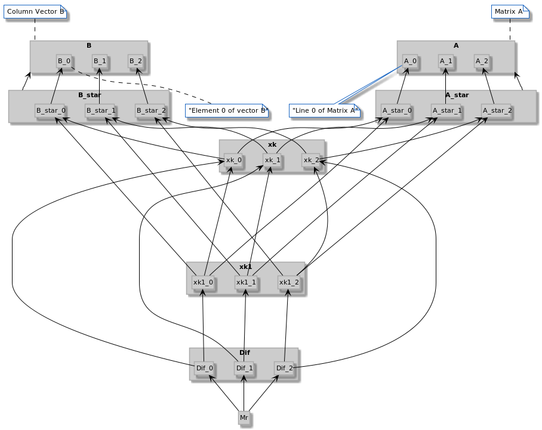

# Jacobi-Richardson PCAM

O problema resume-se em:
 - Criar a matriz A que garanta convergência e criar o vetor coluna B
 - Calcular a matriz A* e B* (a partir de A e B)
 - Calcular o vetor coluna x a cada iteração (a partir de A* e B*)
 - Calcular o vetor Dif a cada iteração (a partir de x)
 - Calcular Mr a cada iteração (a partir de Diff)
 
##### Variáveis principais do problema

|Variável  |Escalar|Linhas|Colunas|Comentário                           |
|----      |----   |----  |----   |---                                  |
|N         |Sim    |-     |-      |ordem do problema                    |
|A         |Não    |N     |N      |matriz do problema                   |
|A*        |Não    |N     |N      |matriz A alterada                    |
|B         |Não    |N     |1      |vetor coluna independente            |
|B*        |Não    |N     |1      |vetor coluna B alterado              |
|x         |Não    |N     |1      |vetor solução atual                  |
|xnew    |Não    |N     |1      |vetor solução novo                   |
|Dif       |Não    |N     |1      |diferença entre soluções consecutivas|
|Mr        |Sim    |-     |-      |erro                                 |
|maxx_new|Sim    |-     |-      |max elemento absoluto de xnew      |
|maxDif  |Sim    |-     |-      |max elemento de Dif                  |

Precedência de variáveis:

### PCAM

Serão utilizadas, no máximo, **T** threads.

#### Particionamento

*DISCLAIMER: o termo bloco foi utilizado para facilitar a referência aos conjuntos que apareceram juntos durante a fase de particionamento. **não necessariamente reflete o resultado da fase de aglomeração*** 

O particionamento será realizado tanto por funcão quanto por dados.

Uma tarefa no início receberá/lerá o valor de **N**.

É necessário gerar **A** e **B**. Cada elemento de **A** e de **B** será gerado por uma tarefa distinta, ou seja, **N\*N** tarefas para **A** (**bloco 1**) e **N** tarefas para **B** (**bloco 2**)

Após gerados todos os elementos, será realizada a análise de convergência a fim de saber se o método convergirá com a matriz **A** gerada. Para realizar o teste, será feita uma tarefa por linha **A**(ou seja, **N** tarefas). Este conjunto de tarefas será denominado **bloco 3**.
Para cada tarefa, enquanto o teste de convergência falhar, a respectiva tarefa incrementará um número aleatório em seu respectivo elemento da diagonal.

Após ter convergência assegurada, serão calculadas as matrizes **A\*** e **B\***.
Para o cálculo de **A\***, será utilizada uma tarefa para cada elemento de **A\*** (**N\*N** tarefas, **bloco 4**) e uma tarefa para cada elemento de **B\*** (**N** tarefas, **bloco 5**)

**N** tarefas (**bloco 6**) serão utilizadas para definir o valor inicial de **x**: uma tarefa para cada elemento de **x**. O valor inicial para **x** será uma cópia de **B\***.

Será realizado pelo **bloco 7** de tarefas em que **N\*N** tarefas realizarão a multiplicação de cada uma das linhas de **A\*** pelos elementos de **x**, cujo resultado será utilizado para o cálculo de **xnew**. Então **N** tarefas (**bloco 8**) realizarão a subtração de cada elemento de **B** com a soma das multiplicações das respectivas linhas, assim obtendo **xnew** e, após isso, calcularão, cada uma, um elemento de **Dif**, que é dado pelo valor absoluto da subtração entre **xnew** e **x**. Aproveitando que cada uma das **N** tarefas terão um valor para **xnew** e para **Dif**, a variável **maxx_new** armazenará o maior valor absoluto dentre os elementos de **xnew** e a variável **maxDif** armazenará o maior valor dentre os elementos de **Dif**.

De posse de **maxDif** e **maxx_new**, uma única tarefa (**bloco 9**) realizará a divisão entre aquele e este para obter **mr**. Se **mr** for menor que 0.001, então houve convergência. Caso contrário, o algoritmo voltará a executar as tarefas do **bloco 7** em diante.

#### Comunicação

A imagem abaixo ilustra as variáveis que precisam ser enviadas de um bloco de tarefas a outro.

A tabela abaixo indica como cada bloco utiliza cada variável do problema

|Variável           |início |bloco 1|bloco 2|bloco 3|bloco 4|bloco 5|bloco 6|bloco 7|bloco 8|bloco 9|
|----               |----   |----   |----   |----   |----   |----   |----   |----   |----   |----   |
|N                  |   w   |   r   |   r   |   r   |   r   |   r   |   r   |   r   |   r   |   -   |
|A                  |   -   |   w   |   -   |  r/w  |   r   |   r   |   -   |   -   |   -   |   -   |
|A*                 |   -   |   -   |   -   |   -   |   w   |   -   |   -   |   r   |   -   |   -   |
|B                  |   -   |   -   |   w   |   -   |   -   |   r   |   -   |   -   |   -   |   -   |
|B*                 |   -   |   -   |   -   |   -   |   -   |   w   |   r   |   -   |   -   |   -   |
|x                  |   -   |   -   |   -   |   -   |   -   |   -   |   w   |   r   |   r   |   -   |
|xnew    |   -   |   -   |   -   |   -   |   -   |   -   |   -   |   w   |   w   |   -   |
|Dif                |   -   |   -   |   -   |   -   |   -   |   -   |   -   |   -   |   w   |   -   |
|maxx_new|   -   |   -   |   -   |   -   |   -   |   -   |   -   |   -   |   w   |   r   |
|maxDif  |   -   |   -   |   -   |   -   |   -   |   -   |   -   |   -   |   w   |   r   |
|Mr                 |   -   |   -   |   -   |   -   |   -   |   -   |   -   |   -   |   -   |   w   |

*No bloco 8 (ou no bloco 9) deve ocorrer o swap entre o

###### Início

A variável N é global, já que todos os outros blocos apenas realizam leitura.

###### Bloco 1: Gera Matriz A

Não há comunicação interna entre as tarefas deste bloco.

###### Bloco 2: Gera Vetor Coluna B

Não há comunicação interna entre as tarefas deste bloco.

###### Bloco 3: Altera Matriz A

Não há comunicação interna entre as tarefas deste bloco.

###### Bloco 4: Cria Matriz A*

Não há comunicação interna entre as tarefas deste bloco.

###### Bloco 5: Cria Vetor Coluna B*

Não há comunicação interna entre as tarefas deste bloco.

###### Bloco 6: Cria x (chute inicial)

Não há comunicação interna entre as tarefas deste bloco.

*Comentário: aqui eu percebi que particionamento por dados (cada tarefa em uma linha) deve ser mais vantajoso, mas vou continuar com particionamento por função para fazer diferente no que fiz nos outros trabalhos.*

###### Bloco 7: Começa cálculo de xnew

Cada tarefa realiza a multiplicação de um elemento de **A\*** por um elemento de **x**. As multiplicações em uma mesma linha de **A\*** sofrem redução de soma, cujo resultado é armazenado na respectiva linha de **xnew**.

###### Bloco 8: Cálculo de xnew, Dif, maxx_new, maxDif

Este bloco conclui o cálculo de cada elemento de **xnew** e também calcula cada elemento de **Dif** e, durante este cálculo, realiza também a redução de max para encontrar o **maxx_new** e o **maxDif**. 

###### Bloco 9: Cálculo de Mr

É uma única tarefa. O resultado deste cálculo é utilizado de sinalização para o algoritmo prosseguir ou parar. Essa sinalização é enviada para o **bloco 7**.

#### Aglomeração

O bloco 1 e o bloco 3 são realizados de maneira serial entre si, sendo que bloco 1 cria a matriz A e o bloco 3 altera a matriz A para que esta garanta a convergência do método. Ambos os blocos podem ser fusionados para que, ao fim da geração de cada linha de A, a estratégia de garantia de convergência já seja executada.
Ao mesmo tempo, a cada linha de A com convergência garantida, a respectiva linha de A* pode ser calculada, assim como o respectivo elemento de B* também pode ser calculado, que também pode já definir o valor inicial para x (que é baseado no valor de B*). Ou seja, Os blocos 1, 2, 3, 4, 5 e 6 tornam-se um bloco só.

O que não foi comentado, pernamece como está.

#### Mapeamento

O mapeamento fica a cargo do Sistema Operacional.